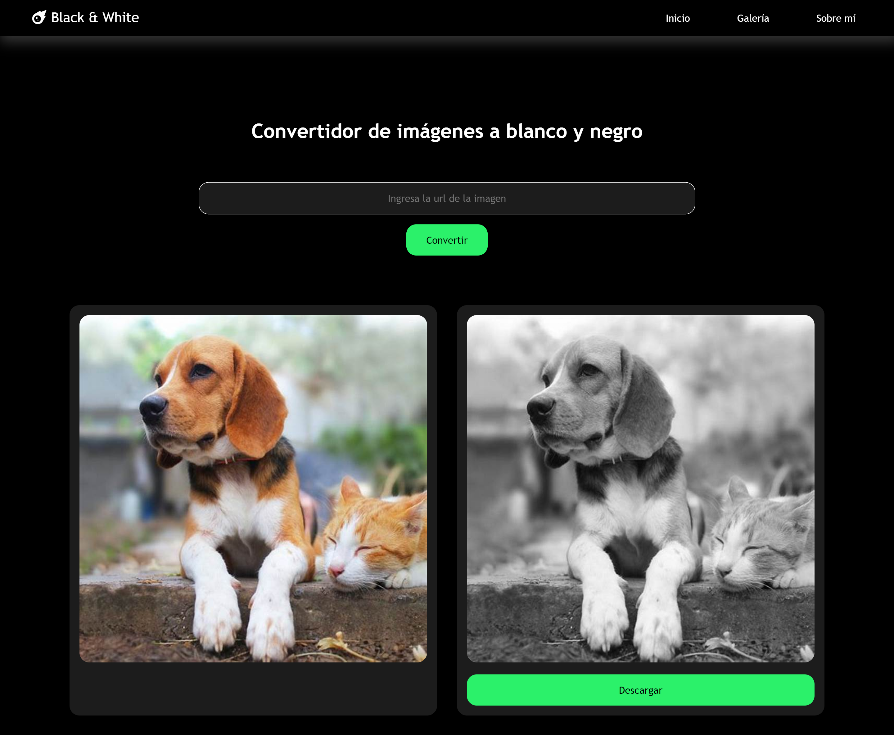
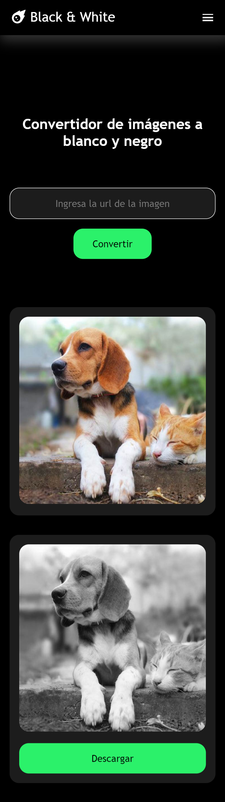

# Desafío - Black and White
En este desafío, se pondrán a prueba los conocimientos de procesamiento de imágenes con JIMP y la descarga de aplicaciones.

## Descripción

La empresa Black and White Spa está promocionando una campaña para las redes sociales en donde quieren ofrecer un sitio web que permita escribir la URL de una imagen de internet y que ésta sea procesada por el servidor para ser devuelta en blanco y negro.

## Screenshots

## Dependencias Usadas

- Express
- Jimp
- UUID
- Nodemon
- Express-handlebars

## Instalación y Uso

- Descarga el repositorio.
- Instala las dependencias usando `npm install express jimp uuid nodemon express-handlebars`.
- Ejecuta el servidor con npm run dev. 